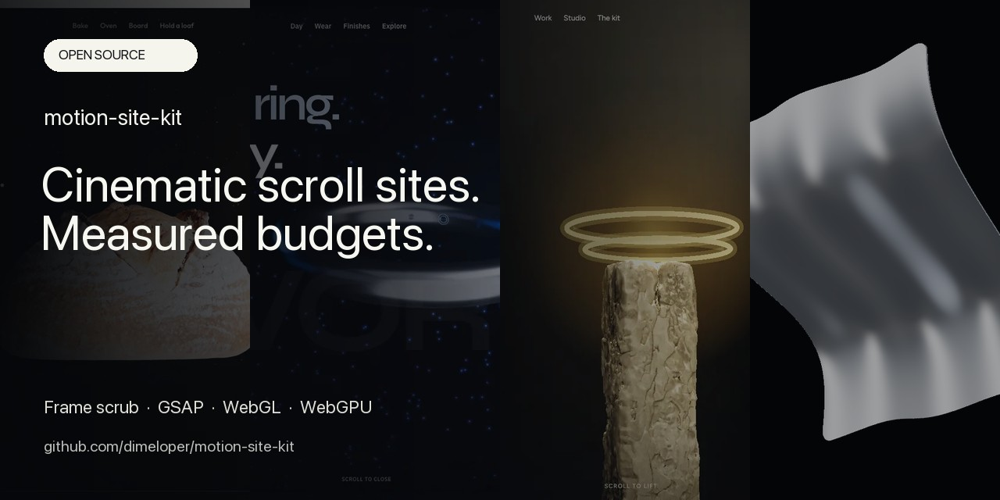

# motion-site-kit

An agent skill for Codex and Claude Code, plus a reskinnable template for building scroll-driven motion websites — a pinned `<canvas>` playing a decoded image sequence, scrubbed by scroll position.

[](https://dimeloper.github.io/motion-site-kit/)

Live demo: [dimeloper.github.io/motion-site-kit](https://dimeloper.github.io/motion-site-kit/)

The kit enforces frame download limits, bounds decoded bitmap storage and keeps animation available on phones. It includes four examples and reusable page compositions.

```
source clip ──▶ extract N frames ──▶ responsive ladder ──▶ budget gate ──▶ site
   (video)         (ffmpeg)          (AVIF/WebP, 3 widths)  (CI fails      (canvas +
                                                             on breach)     ScrollTrigger)
```

## What's in the box

| Path | What it is |
|---|---|
| `skills/motion-website/` | The agent skill: build recipe, reference docs, pipeline scripts |
| `template/` | Default site (frame scrub). Edit `config.js`; keep `src/motion.js` for frame projects |
| `motion.config.json` | Frame counts, widths, and the performance budget CI enforces |
| `.github/workflows/budget.yml` | The gate that refuses a merge when the sequence gets heavy |
| `scripts/vendor.sh` | Optional: vendor GSAP + Lenis locally instead of loading them from a CDN |
| `scripts/use-demo-frames.sh` | Copy the committed `docs/frames` ladder into `template/frames` so a reskin needs no clip |
| `examples/` | [Harbor orbit](https://dimeloper.github.io/motion-site-kit/examples/local/), [Vortex peel-seat](https://dimeloper.github.io/motion-site-kit/examples/saas/), [Halo studio](https://dimeloper.github.io/motion-site-kit/examples/commerce/). New pages compose from `docs/kit/`. |

The optional [Fold vgpu study](docs/examples/vgpu/README.md) adds a deterministic
scroll-driven shader with a real poster and device-loss fallback. Its generated
static build is at `docs/examples/vgpu/demo/`; only editing it needs Vite.

## Choose a starting point

- **Try it without installing anything:** open the [live examples](https://dimeloper.github.io/motion-site-kit/) or [page recipes](https://dimeloper.github.io/motion-site-kit/kit/).
- **Build a frame-scrub site:** use the quick start below, then edit `template/config.js`.
- **Compose a portfolio or landing page:** start with one of four recipes in `docs/kit/recipes.js` and preview it at `/kit/preview.html?recipe=studio`.
- **Edit a WebGL or WebGPU example:** follow the example-specific path in [onboarding](docs/ONBOARDING.md).

If you already have a product turntable clip, follow the [product-reveal use case](docs/USE-CASE-PRODUCT-REVEAL.md). It takes the clip through extraction, responsive encoding, a config-only reskin and the final budget check.

## Quick start

A clone already contains a committed frame ladder under `docs/` — that is what GitHub Pages serves. You do not need ffmpeg, Pillow, or a source clip to see the site move.

```bash
git clone https://github.com/dimeloper/motion-site-kit
cd motion-site-kit
python3 -m http.server 8080 --directory docs
# http://localhost:8080               landing page (frame scrub)
# http://localhost:8080/examples/local/  Harbor (saas/ for Vortex, commerce/ for Halo)
# http://localhost:8080/examples/vgpu/demo/  Fold material study
# http://localhost:8080/kit/          section-family specimen
```

To reskin the standalone template with that same ladder:

```bash
./scripts/use-demo-frames.sh
cd template && python3 -m http.server 8080
```

Then edit `template/config.js` — copy, colors, fonts, section order. Nothing else needs to change.

### Bring your own clip

```bash
pip install "Pillow>=11.3"          # AVIF + WebP encoding
# ffmpeg must be on PATH for extraction

python3 skills/motion-website/scripts/extract_frames.py hero.mp4 \
  --out frames/raw --count 120 --width 1600

python3 skills/motion-website/scripts/optimize_frames.py frames/raw \
  --out template/frames --config motion.config.json

python3 skills/motion-website/scripts/check_budget.py --config motion.config.json
```

### No CDN

The template resolves GSAP and Lenis through an import map pointed at a CDN, so it runs from any static host with no toolchain. To drop the third-party runtime dependency entirely:

```bash
./scripts/vendor.sh
```

This installs both packages, copies their ESM builds into `template/vendor/`, and rewrites the import map to local paths. Use this when your deployment must serve its runtime dependencies locally.

## Using it as an agent skill

For Codex, run from the repository root:

```bash
mkdir -p ~/.agents/skills
cp -r skills/motion-website ~/.agents/skills/
```

Codex discovers personal skills in `~/.agents/skills`; invoke `$motion-website`
or describe a matching task. See the [official skill documentation](https://learn.chatgpt.com/docs/build-skills).

For Claude Code:

```bash
mkdir -p ~/.claude/skills
cp -r skills/motion-website ~/.claude/skills/
```

It triggers on scroll animations, pinned heroes, image sequences, GSAP ScrollTrigger, Lenis, and on debugging questions like "why does my scroll animation stutter."

## Design decisions worth knowing about

**Frame count.** Start with 120 frames, then inspect the sequence at its intended scroll range. More frames increase transfer and decoding work; keep them only when they improve the result.

**Phones get the animation.** The runtime selects a responsive frame ladder for small screens. The static fallback is reserved for `prefers-reduced-motion`, Save-Data, and 2G, where it's an actual user signal rather than a guess based on screen size.

**Asset budgets.** CI checks every advertised frame against the configured byte limits. `check_budget.py` exits 1 and prints what to cut, in order.

**GSAP for the hero, native CSS for the trim.** Scroll-driven CSS animations (`animation-timeline: scroll()`) ship in Chrome 115+ and Safari 26+ but not Firefox, which keeps them out of Baseline. The kit uses them behind `@supports` for the progress bar, where a Firefox visitor losing the effect costs nothing, and keeps ScrollTrigger for the hero, where it doesn't.

**Bound decoded memory as well as downloads.** Compressed frames preload with eight requests at a time. A `createImageBitmap` cache then decodes the requested frame and nearby frames within a 128 MiB RGBA budget, including the in-flight decode. At 1600×900 that is about 23 decoded frames, instead of retaining all 120 (roughly 659 MiB). Rapid scroll changes reprioritize decoding; the last valid canvas frame remains visible until the requested frame is ready. This bounds bitmap storage, not the browser’s total process memory.

**The poster is a real ``.** If the canvas is the LCP candidate and stays blank until 120 frames decode, LCP is measured at the end of preload — a bad score for a page that felt instant.

## Verification and maintenance

```bash
python3 -m unittest discover -s tests -p 'test_*.py'
python3 skills/motion-website/scripts/check_budget.py --frames docs/frames --strict
python3 scripts/check_example_budget.py
python3 scripts/sync_examples.py --check
npm ci --prefix scripts/hero-clip
node --test tests/*.mjs
npm ci --prefix docs/examples/vgpu
npm run check --prefix docs/examples/vgpu
npm run test:motion --prefix scripts/hero-clip
```

Browser tests require Node 22.12+ and Chrome. On non-macOS systems set
`CHROME_PATH` to the Chrome executable. Tests serve pinned local GSAP and Lenis
packages, exercise forward/reverse canvas output, WebGL offscreen suspension,
context loss and failure recovery, and
check live bitmap RGBA accounting, configuration failures, keyboard menus and
accessibility. Fold checks WebGPU drawing when available and its poster fallback. They do not replace real-phone cellular QA.

On macOS, enable Safari's Allow remote automation, start `safaridriver -p 4444`
in a separate terminal, then run `node scripts/hero-clip/test-safari.mjs` from
the repository root. Physical iPhone checks use the same script with
`SAFARI_DEVICE_UDID` and a phone-reachable `SAFARI_BASE_URL` (HTTPS for WebGPU).
The phone must be unlocked, trusted and have Safari Remote Automation enabled.
See [release QA](docs/RELEASE-QA.md) for evidence and remaining limits.

The frame gate checks actual bytes, every advertised frame and format, and
manifest consistency. `--strict` requires a ladder to exist; without it a fresh
template clone still skips cleanly. Only `docs/frames` is a committed ladder.
The ignored example ladders are legacy local artifacts; Harbor and Halo load
GLBs while Vortex constructs its CAD band in code. Stored GLBs are checked separately with a 2 MiB/model and 128 KiB first-party JS ceiling.
The [measurement report](docs/MEASUREMENTS.md) separately records local page
resources and texture-storage estimates. The gates do not claim to measure
production transfer, GPU residency or real-device performance.

Edit WebGL examples under `docs/examples/`, then run
`python3 scripts/sync_examples.py --write` to update their `examples/` mirrors.
The same command copies the shared frame engine from `template/src` to
`docs/src`, preserving the independent demo config. CI rejects mirror drift.

## Licensing of the dependencies

| | License | Notes |
|---|---|---|
| This kit | MIT | Including the skill and scripts |
| GSAP + ScrollTrigger | Free, commercial use included | Since April 2025. One carve-out: no building a competing no-code animation builder |
| Lenis | MIT | |
| Remotion | **Not MIT** | Free up to 3 people; a Company License at 4+. Optional path only — see below |

The Remotion caveat matters for client work: a solo freelancer can use it free if the deliverable is the rendered output, but handing over the Remotion project itself aggregates both headcounts toward the 4-person threshold. If you ship source to clients, keep them on the ffmpeg path. Details in [`skills/motion-website/references/remotion.md`](skills/motion-website/references/remotion.md).

## Requirements

- Python 3.10+ with `Pillow>=11.3` (AVIF support)
- `ffmpeg` and `ffprobe` on PATH
- Any static host

## Docs

- [Product-reveal use case](docs/USE-CASE-PRODUCT-REVEAL.md) — take one turntable clip from extraction to a checked landing page
- [Local measurements](docs/MEASUREMENTS.md) — transfer, bitmap storage, texture estimates and their limits
- [Engine selection](skills/motion-website/references/engine-selection.md) — frames, Three.js, vgpu and conditional library choices
- [Scroll engine](skills/motion-website/references/scroll-engine.md) — ScrollTrigger + Lenis wiring, pin/scrub math
- [Frame pipeline](skills/motion-website/references/frame-pipeline.md) — extraction, encoding, the ladder, manifest format
- [Performance budget](skills/motion-website/references/performance-budget.md) — where the numbers come from, what to cut first
- [Remotion](skills/motion-website/references/remotion.md) — programmatic frames, and when they're worth it
- [QA checklist](skills/motion-website/references/qa.md) — run this before shipping

## License

MIT. See [LICENSE](LICENSE).
