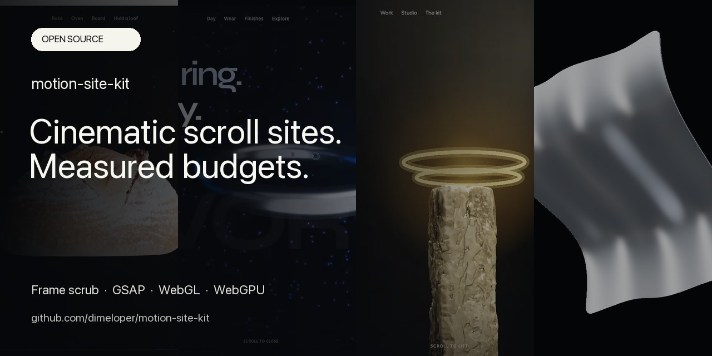

# motion-site-kit

An agent skill for Codex and Claude Code, plus a reskinnable template for building scroll-driven motion websites — a pinned `<canvas>` playing a decoded image sequence, scrubbed by scroll position.

[](https://dimeloper.github.io/motion-site-kit/)

Live demo: [dimeloper.github.io/motion-site-kit](https://dimeloper.github.io/motion-site-kit/)

The kit enforces frame download limits, bounds decoded bitmap storage and keeps animation available on phones. It includes four examples and reusable page compositions.

```
source clip ──▶ extract N frames ──▶ responsive ladder ──▶ budget gate ──▶ site
   (video)         (ffmpeg)          (AVIF/WebP, 3 widths)  (CI fails      (canvas +
                                                             on breach)     ScrollTrigger)
```

## What's in the box

| Path | What it is |
|---|---|
| `skills/motion-website/` | The agent skill: build recipe, reference docs, pipeline scripts, and the template and budget config it hands out |
| `template/` | Link to the skill's `assets/template/`, the default frame-scrub site. Edit `config.js`; keep `src/motion.js` |
| `motion.config.json` | Link to the skill's budget config: frame counts, widths and the limits CI enforces |
| `docs/` | The GitHub Pages site: landing page, the [WebGL examples](docs/examples/), the [page kit](docs/kit/) and the [Fold](docs/examples/vgpu/README.md) WebGPU study |
| `scripts/` | Repository tooling: demo frames, CDN-free vendoring, the example gate, browser tests |
| `tests/` | Unit tests for the gate, the pipeline, the decode cache, rung selection and the page kit |

The examples: [Harbor](https://dimeloper.github.io/motion-site-kit/examples/local/) orbits a loaf, [Vortex](https://dimeloper.github.io/motion-site-kit/examples/saas/) peels particles off a titanium band, [Halo](https://dimeloper.github.io/motion-site-kit/examples/commerce/) lifts rings of light off stone, and [Fold](https://dimeloper.github.io/motion-site-kit/examples/vgpu/demo/) is a scroll-driven WebGPU material.

The template and budget config live inside the skill so that a copied skill directory works on its own. The root `template/` and `motion.config.json` are symlinks to them, so every command below works from the repository root. On Windows, enable symlinks in Git (`core.symlinks`) before cloning.

## Choose a starting point

- **Try it without installing anything:** open the [live examples](https://dimeloper.github.io/motion-site-kit/) or [page recipes](https://dimeloper.github.io/motion-site-kit/kit/).
- **Build a frame-scrub site:** use the quick start below, then edit `template/config.js`.
- **Compose a portfolio or landing page:** start with one of four recipes in `docs/kit/recipes.js` and preview it at `/kit/preview.html?recipe=studio`.
- **Edit a WebGL or WebGPU example:** follow the example-specific path in [onboarding](docs/ONBOARDING.md).

If you already have a product turntable clip, follow the [product-reveal use case](docs/USE-CASE-PRODUCT-REVEAL.md). It takes the clip through extraction, responsive encoding, a config-only reskin and the final budget check.

## Quick start

### Give this to your agent

Paste this into Claude Code, Codex or any agent that can run shell commands. Fill in your product and clip first.

```text
Clone https://github.com/dimeloper/motion-site-kit into a temporary folder and
copy its skills/motion-website directory into your skills folder
(~/.claude/skills for Claude Code, ~/.agents/skills for Codex). Then follow
that skill's SKILL.md to build a scroll-driven hero page for <product> in this
directory, from my clip at <path/to/clip.mp4>. Install ffmpeg and Pillow 11.3+
if they are missing. Leave template/src unchanged; the copy and styling go in
template/config.js. Don't stop until check_budget.py passes.
```

The skill runs extraction, encoding and the budget gate, then builds the page in `template/`, which is the directory to serve. Its QA checklist lists the checks left for a real phone.

### Run it yourself

A clone already contains a committed frame ladder under `docs/`, which is what GitHub Pages serves. You do not need ffmpeg, Pillow or a source clip to see the site move.

```bash
git clone https://github.com/dimeloper/motion-site-kit
cd motion-site-kit
python3 -m http.server 8080 --directory docs
# http://localhost:8080                      landing page (frame scrub)
# http://localhost:8080/examples/local/      Harbor (saas/ for Vortex, commerce/ for Halo)
# http://localhost:8080/examples/vgpu/demo/  Fold material study
# http://localhost:8080/kit/                 section-family specimen
```

To reskin the standalone template with that same ladder:

```bash
./scripts/use-demo-frames.sh
cd template && python3 -m http.server 8080
```

Then edit `template/config.js`: copy, colours, fonts, section order. Set the `<title>` and meta description in `template/index.html` to match, for crawlers and visitors without JavaScript. Nothing else needs to change.

#### Bring your own clip

```bash
pip install -r requirements.txt     # Pillow >= 11.3, for AVIF and WebP
# ffmpeg and ffprobe must be on PATH for extraction

python3 skills/motion-website/scripts/extract_frames.py hero.mp4 \
  --out frames/raw --count 120 --width 1600

python3 skills/motion-website/scripts/optimize_frames.py frames/raw \
  --out template/frames --config motion.config.json

python3 skills/motion-website/scripts/check_budget.py --config motion.config.json
```

`optimize_frames.py` also writes one poster per rung to `template/frames/poster/`, which the page's `` loads by fixed name, so a different frame count never breaks the hero image.

#### No CDN

The template resolves GSAP and Lenis through an import map pointed at a CDN, so it runs from any static host with no toolchain. To drop the third-party runtime dependency:

```bash
./scripts/vendor.sh
```

This installs both packages, copies their ESM builds into `template/vendor/` and rewrites the import map to local paths.

## Using it as an agent skill

The skill directory is self-contained: it carries the template, the budget config and the scripts. Copy it where your agent looks for skills.

For Claude Code:

```bash
mkdir -p ~/.claude/skills
cp -R skills/motion-website ~/.claude/skills/
```

For Codex, which read personal skills from `~/.agents/skills` when this was written (September 2026):

```bash
mkdir -p ~/.agents/skills
cp -R skills/motion-website ~/.agents/skills/
```

It triggers on scroll animations, pinned heroes, image sequences, GSAP ScrollTrigger, Lenis, and on debugging questions like "why does my scroll animation stutter." The WebGL examples and the page kit stay in this repository; the skill links to them.

## Design decisions worth knowing about

**Frame count.** Start with 120 frames, then inspect the sequence at its intended scroll range. More frames increase transfer and decoding work; keep them only when they improve the result.

**Phones get the animation.** A phone at 2x or 3x selects the 960px rung and a 1x or 1.5x small screen the 640px rung. Both carry a 1.5 MB ceiling, separate from the 8 MiB allowed for larger rungs. The static fallback is reserved for `prefers-reduced-motion`, Save-Data and 2G, which are user signals rather than a guess based on screen size.

**Asset budgets.** CI checks every advertised frame against the configured byte limits. `check_budget.py` exits 1 and prints what to cut, in order.

**GSAP for the hero, native CSS for the trim.** Scroll-driven CSS animations (`animation-timeline: scroll()`) ship in Chrome 115+ and Safari 26+ but not Firefox, which keeps them out of Baseline. The kit uses them behind `@supports` for the progress bar, where a Firefox visitor losing the effect costs nothing, and keeps ScrollTrigger for the hero, where it doesn't.

**Bound decoded memory as well as downloads.** Compressed frames preload with eight requests at a time. A `createImageBitmap` cache then decodes the requested frame and nearby frames within a 128 MiB RGBA budget, including the in-flight decode. At 1600×900 that is about 23 decoded frames, instead of retaining all 120 (roughly 659 MiB). This bounds bitmap storage, not the browser's total process memory.

**The page does not move under the visitor.** The pin engages only after every frame has downloaded. If the visitor has scrolled past the hero by then, the engine keeps the content they are reading in place. The pin length is measured in `svh`, so a collapsing mobile URL bar does not jump the sequence.

**The poster is a real ``.** If the canvas is the LCP candidate and stays blank until 120 frames decode, LCP is measured at the end of preload, a bad score for a page that felt instant.

## Verification and maintenance

```bash
pip install -r requirements.txt
python3 -m unittest discover -s tests -p 'test_*.py'
python3 skills/motion-website/scripts/check_budget.py --frames docs/frames --strict
python3 scripts/check_example_budget.py
python3 scripts/sync_engine.py --check
node --test tests/*.mjs
npm ci --prefix scripts/hero-clip
npm run test:motion --prefix scripts/hero-clip
npm ci --prefix docs/examples/vgpu
npm run check --prefix docs/examples/vgpu
```

The pipeline test runs extraction, encoding and the gate on a synthetic clip. It skips when ffmpeg or Pillow is missing; CI installs both and sets `REQUIRE_PIPELINE=1` so it cannot skip there.

Browser tests need Node 22.12+ and Chrome; off macOS, set `CHROME_PATH`. They serve pinned local GSAP, Lenis and Three.js packages. They cover forward and reverse canvas output, the decoded-memory bound, pinning after a slow preload, resize handling, WebGL idle drawing, GPU leaks across bfcache restores, the menu scroll lock, context loss, failure recovery, configuration errors and accessibility. Safari and physical-iPhone runs are described in the [QA checklist](skills/motion-website/references/qa.md#automated-checks). None of it replaces a real phone on cellular.

The frame gate checks actual bytes, every advertised frame and format, the posters and manifest consistency. `--strict` requires a ladder to exist; without it a fresh template clone skips cleanly. Only `docs/frames` is a committed ladder. `check_example_budget.py` caps each example GLB at 2 MiB and each example's first-party JavaScript at 128 KiB, and fails on any model or image that nothing references.

`docs/src` holds a copy of the frame engine, because GitHub Pages cannot follow the `template/` symlink out of `docs/`. After editing `template/src`, run `python3 scripts/sync_engine.py --write`. CI rejects drift. The [measurement report](docs/MEASUREMENTS.md) records local page resources and texture estimates, and what they do not establish.

## Licensing

| | License | Notes |
|---|---|---|
| This kit's code | MIT | Including the skill, scripts and template |
| GSAP + ScrollTrigger | Free, commercial use included | Since April 2025. One carve-out: no building a competing no-code animation builder |
| Lenis | MIT | |
| Three.js | MIT | WebGL examples only |
| Manrope | SIL Open Font License | Self-hosted on the docs site; license text alongside |
| Example images and models | Their own terms | Not covered by MIT. See [the asset register](docs/examples/ASSETS.md) |
| Remotion | **Not MIT** | Free up to 3 people; a Company License at 4+. Optional path only |

The Remotion caveat matters for client work: a solo freelancer can use it free if the deliverable is the rendered output, but handing over the Remotion project itself aggregates both headcounts toward the 4-person threshold. If you ship source to clients, keep them on the ffmpeg path. Details in [`skills/motion-website/references/remotion.md`](skills/motion-website/references/remotion.md).

## Requirements

- Python 3.10+ with `Pillow>=11.3` (AVIF support)
- `ffmpeg` and `ffprobe` on PATH
- Any static host

## Docs

- [Product-reveal use case](docs/USE-CASE-PRODUCT-REVEAL.md): take one turntable clip from extraction to a checked landing page
- [Onboarding](docs/ONBOARDING.md): where to start for each kind of change
- [Local measurements](docs/MEASUREMENTS.md): transfer, bitmap storage, GPU resources and their limits
- [Asset register](docs/examples/ASSETS.md): source and terms for every shipped image, model and font
- [Engine selection](skills/motion-website/references/engine-selection.md): frames, Three.js, vgpu and conditional library choices
- [Scroll engine](skills/motion-website/references/scroll-engine.md): ScrollTrigger and Lenis wiring, pin maths, resizes, modals
- [Frame pipeline](skills/motion-website/references/frame-pipeline.md): extraction, encoding, the ladder, posters, portrait phones
- [Performance budget](skills/motion-website/references/performance-budget.md): where the numbers come from, what to cut first
- [Remotion](skills/motion-website/references/remotion.md): programmatic frames, and when they're worth it
- [QA checklist](skills/motion-website/references/qa.md): run this before shipping

## License

MIT for the code. See [LICENSE](LICENSE), and the asset register for images, models and fonts.
